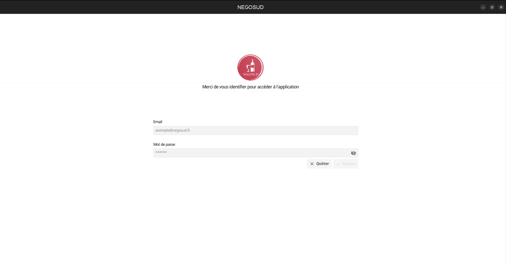
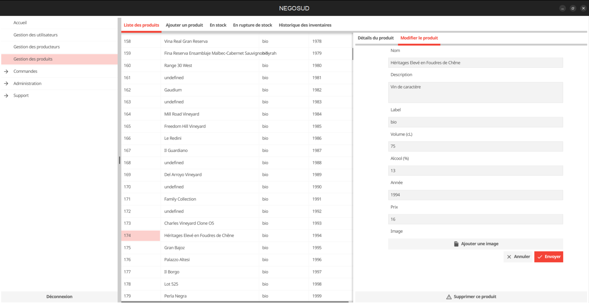
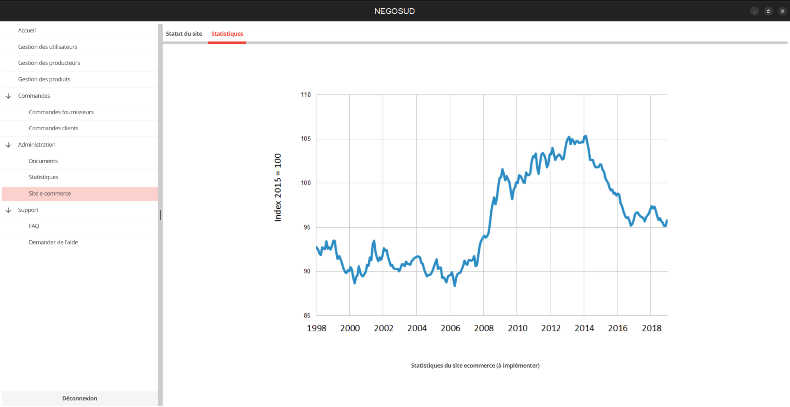
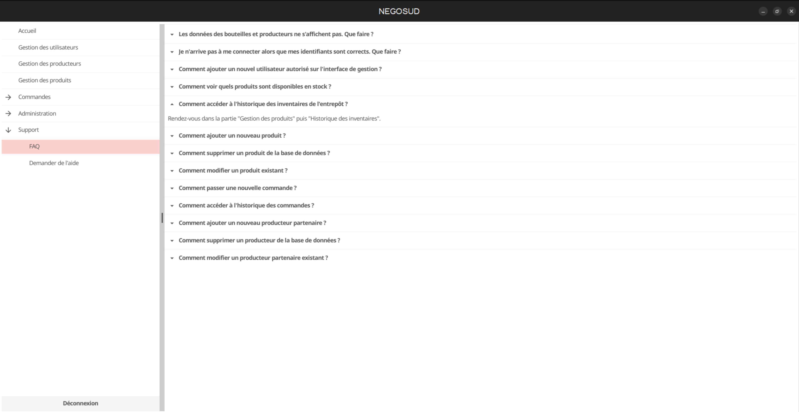

# :wine_glass: NEGOSUD-GUI :wine_glass:
### *Logiciel de gestion de stock et d'inventaire pour un négociant en vin* 

---

---

Langage : [Go](https://go.dev/)

Framework : [Fyne](https://github.com/fyne-io/fyne)

---

---

## :computer: Prérequis

*Nécessite l'installation de **[Go ~1.19](https://go.dev/dl/)**

``` 
git clone https://github.com/ClrGe/negosud-gui.git
```
```
cd negosud-gui && go mod tidy
```
Compiler le programme :
```
go run main.go
```
Créer un exécutable :
```
go build
```

---

## :closed_lock_with_key: Sécurité

*Accès authentifié par JWT acquis à la connexion pour les requêtes API*



---

## :open_file_folder: Gestion
*Produits / commandes / fournisseurs / producteurs / stocks / documents administratifs* 



---

## :chart_with_upwards_trend: Monitoring

*Historique des prix / activité / site e-commerce / rentabilité*



---

## :clock4: Support
*Formulaire de contact des développeurs et documentation (FAQ)*



---

---